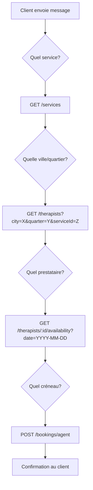

# 📱 Documentation API - Agent WhatsApp KmerServices

Cette documentation détaille tous les endpoints API disponibles pour l'intégration de l'agent WhatsApp (n8n ou autre).

**Base URL** : `https://kmerbeauty-production.up.railway.app/api/v1`

---

## 🔐 Sécurité

### Authentification Agent
L'endpoint `/bookings/agent` est **protégé par une clé API**. Vous devez inclure le header suivant dans toutes les requêtes :

```
x-agent-key: VOTRE_CLE_SECRETE
```

> ⚠️ **Important** : Contactez l'administrateur pour obtenir la clé API. Ne partagez jamais cette clé publiquement.

### Rate Limiting
- **Global** : 60 requêtes par minute par IP
- **Endpoint Agent** : 10 requêtes par minute (plus strict)

### Validation du numéro
Le numéro de téléphone doit être au format international Cameroun : `+237XXXXXXXXX`

---

## 📋 Table des matières

1. [Services](#1-services)
2. [Prestataires (Therapists)](#2-prestataires-therapists)
3. [Disponibilités](#3-disponibilités)
4. [Réservation Agent](#4-réservation-agent)

---

## 1. Services

### Lister tous les services

Récupère la liste de tous les services disponibles sur la plateforme.

```bash
curl -X GET "https://kmerbeauty-production.up.railway.app/api/v1/services" \
  -H "Content-Type: application/json"
```

**Réponse :**
```json
[
  {
    "id": "uuid-service-1",
    "name_fr": "Coiffure Femme",
    "name_en": "Women's Hairstyling",
    "description_fr": "Coupe, brushing et soins capillaires",
    "category": "HAIRDRESSING",
    "images": ["https://..."],
    "duration": 60,
    "base_price": 5000
  }
]
```

### Lister les services par catégorie

```bash
curl -X GET "https://kmerbeauty-production.up.railway.app/api/v1/services?category=HAIRDRESSING" \
  -H "Content-Type: application/json"
```

**Catégories disponibles :**
| Code | Description |
|------|-------------|
| `HAIRDRESSING` | Coiffure |
| `EYE_CARE` | Soins des yeux |
| `WELLNESS_MASSAGE` | Massage |
| `FACIAL` | Soins du visage |
| `NAIL_CARE` | Manucure/Pédicure |
| `MAKEUP` | Maquillage |
| `WAXING` | Épilation |
| `BARBER` | Barbier |

### 🌟 Recherche intelligente de services (Recommandé pour l'agent)

Cet endpoint permet de chercher des services en **langage naturel**. Il gère les synonymes et les termes approximatifs.

```bash
curl -X GET "https://kmerbeauty-production.up.railway.app/api/v1/services/search?q=coiffure" \
  -H "Content-Type: application/json"
```

**Exemples de recherches supportées :**

| Terme recherché | Services trouvés |
|-----------------|------------------|
| `coiffure`, `cheveux`, `coupe`, `tresse` | Services HAIRDRESSING |
| `massage`, `relaxation`, `spa`, `détente` | Services WELLNESS_MASSAGE |
| `ongles`, `manucure`, `vernis` | Services NAIL_CARE |
| `maquillage`, `makeup` | Services MAKEUP |
| `visage`, `facial`, `soin`, `gommage` | Services FACIAL |
| `épilation`, `cire`, `waxing` | Services WAXING |
| `barbe`, `barbier`, `rasage` | Services BARBER |
| `sourcils`, `cils`, `yeux` | Services EYE_CARE |

**Réponse :**
```json
[
  {
    "id": "uuid-service",
    "name_fr": "Coupe Femme",
    "name_en": "Women's Haircut",
    "category": "HAIRDRESSING",
    "base_price": 5000,
    "duration": 60
  }
]
```

> 💡 Les résultats sont triés par pertinence (correspondance exacte du nom en premier).

---

## 2. Prestataires (Therapists)

### Lister tous les prestataires

```bash
curl -X GET "https://kmerbeauty-production.up.railway.app/api/v1/therapists" \
  -H "Content-Type: application/json"
```

### Rechercher par ville

```bash
curl -X GET "https://kmerbeauty-production.up.railway.app/api/v1/therapists?city=Douala" \
  -H "Content-Type: application/json"
```

### 🌟 Recherche intelligente par quartier (Recommandé pour l'agent)

Cette requête **priorise** les prestataires qui couvrent spécifiquement le quartier demandé.

```bash
curl -X GET "https://kmerbeauty-production.up.railway.app/api/v1/therapists?city=Douala&quarter=Akwa" \
  -H "Content-Type: application/json"
```

**Comportement :**
1. Les prestataires avec `"Akwa"` dans leur `serviceZones` apparaissent **en premier**.
2. Ensuite, les autres prestataires de Douala.

### Rechercher par service ET localisation

```bash
curl -X GET "https://kmerbeauty-production.up.railway.app/api/v1/therapists?city=Douala&quarter=Bonanjo&serviceId=uuid-service-coiffure" \
  -H "Content-Type: application/json"
```

**Réponse :**
```json
[
  {
    "id": "uuid-therapist-1",
    "bio_fr": "Coiffeuse professionnelle avec 5 ans d'expérience",
    "experience": 5,
    "rating": 4.8,
    "city": "Douala",
    "service_zones": ["Akwa", "Bonanjo", "Bonapriso"],
    "profile_image": "https://...",
    "user": {
      "id": "uuid-user",
      "first_name": "Marie",
      "last_name": "Dupont",
      "phone": "+237699000001"
    },
    "service_price": 8000,
    "service_duration": 45
  }
]
```

### Obtenir les détails d'un prestataire

```bash
curl -X GET "https://kmerbeauty-production.up.railway.app/api/v1/therapists/uuid-therapist-id" \
  -H "Content-Type: application/json"
```

### Obtenir les services d'un prestataire

```bash
curl -X GET "https://kmerbeauty-production.up.railway.app/api/v1/therapists/uuid-therapist-id/services" \
  -H "Content-Type: application/json"
```

**Réponse :**
```json
[
  {
    "price": 8000,
    "duration": 45,
    "service": {
      "id": "uuid-service",
      "name_fr": "Coupe Femme",
      "name_en": "Women's Haircut",
      "category": "HAIRDRESSING"
    }
  }
]
```

---

## 3. Disponibilités

### Vérifier les créneaux disponibles

Récupère les créneaux horaires libres pour un prestataire à une date donnée.

```bash
curl -X GET "https://kmerbeauty-production.up.railway.app/api/v1/therapists/uuid-therapist-id/availability?date=2024-01-20" \
  -H "Content-Type: application/json"
```

**Réponse :**
```json
["09:00", "10:00", "11:00", "14:00", "15:00", "16:00"]
```

> ⚠️ Le format de date est `YYYY-MM-DD`. Les créneaux retournés sont au format `HH:mm`.

---

## 4. Réservation Agent

### 🚀 Créer une réservation (Endpoint Agent Sécurisé)

Cet endpoint est **spécialement conçu pour l'agent WhatsApp**. Il gère automatiquement :
- La création d'un compte utilisateur si le numéro est inconnu
- Le calcul des prix et durées
- La création de la réservation

```bash
curl -X POST "https://kmerbeauty-production.up.railway.app/api/v1/bookings/agent" \
  -H "Content-Type: application/json" \
  -H "x-agent-key: VOTRE_CLE_SECRETE" \
  -d '{
    "customerPhone": "+237699123456",
    "customerName": "Jean Kamga",
    "serviceIds": ["uuid-service-coiffure"],
    "therapistId": "uuid-therapist-id",
    "scheduledAt": "2024-01-20T10:00:00Z",
    "city": "Douala",
    "quarter": "Akwa",
    "street": "Rue de la Liberté"
  }'
```

**Paramètres :**

| Champ | Type | Obligatoire | Description |
|-------|------|-------------|-------------|
| `customerPhone` | string | ✅ | Numéro au format `+237XXXXXXXXX` |
| `customerName` | string | ❌ | Nom du client (défaut: "Guest") |
| `serviceIds` | string[] | ✅ | Liste des IDs de services à réserver |
| `therapistId` | string | ⚠️ | ID du prestataire (ou `salonId`) |
| `salonId` | string | ⚠️ | ID du salon (si réservation en salon) |
| `scheduledAt` | string | ✅ | Date/heure ISO 8601 |
| `city` | string | ✅ | Ville de la prestation |
| `quarter` | string | ❌ | Quartier |
| `street` | string | ❌ | Rue / Adresse précise |

**Réponse (succès) :**
```json
{
  "id": "uuid-booking",
  "user_id": "uuid-user",
  "therapist_id": "uuid-therapist",
  "scheduled_at": "2024-01-20T10:00:00.000Z",
  "duration": 45,
  "location_type": "HOME",
  "city": "Douala",
  "quarter": "Akwa",
  "subtotal": 8000,
  "total": 8000,
  "status": "PENDING",
  "items": [
    {
      "id": "uuid-item",
      "service_name": "Coupe Femme",
      "price": 8000,
      "duration": 45
    }
  ],
  "provider": {
    "id": "uuid-therapist",
    "profile_image": "https://...",
    "user": {
      "first_name": "Marie",
      "last_name": "Dupont",
      "phone": "+237699000001"
    }
  }
}
```

**Erreurs possibles :**

| Code | Message | Cause |
|------|---------|-------|
| 401 | `Invalid or missing agent key` | Header `x-agent-key` manquant ou invalide |
| 400 | `Invalid phone number format` | Numéro pas au format +237XXXXXXXXX |
| 400 | `At least one serviceId is required` | Aucun service spécifié |
| 429 | `Too Many Requests` | Limite de 10 requêtes/min dépassée |

---

## 🔄 Workflow typique de l'Agent

Voici le flux recommandé pour l'agent WhatsApp :



### Exemple de conversation :

1. **Client** : "Je veux une coiffure"
2. **Agent** : Appelle `GET /services?category=HAIRDRESSING` → Affiche les options
3. **Client** : "Je suis à Akwa, Douala"
4. **Agent** : Appelle `GET /therapists?city=Douala&quarter=Akwa&serviceId=X` → Affiche les prestataires
5. **Client** : "Je veux Marie Dupont"
6. **Agent** : Appelle `GET /therapists/uuid/availability?date=2024-01-20` → Affiche les créneaux
7. **Client** : "10h"
8. **Agent** : Appelle `POST /bookings/agent` avec toutes les infos + header `x-agent-key`
9. **Agent** : "Votre réservation est confirmée ! Marie vous contactera."

---

## 📌 Notes importantes

1. **Numéros de téléphone** : Toujours au format international `+237XXXXXXXXX`
2. **Dates** : Format ISO 8601 `YYYY-MM-DDTHH:mm:ssZ`
3. **IDs** : Tous les IDs sont des UUIDs
4. **Clé API** : Obligatoire pour `/bookings/agent`, à configurer dans n8n

---

## ⚙️ Configuration n8n

Dans votre workflow n8n, configurez le nœud HTTP Request comme suit :

**Headers à ajouter :**
```
Content-Type: application/json
x-agent-key: {{$env.WHATSAPP_AGENT_KEY}}
```

> 💡 Stockez votre clé API dans les variables d'environnement n8n pour plus de sécurité.
